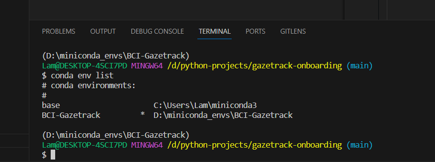
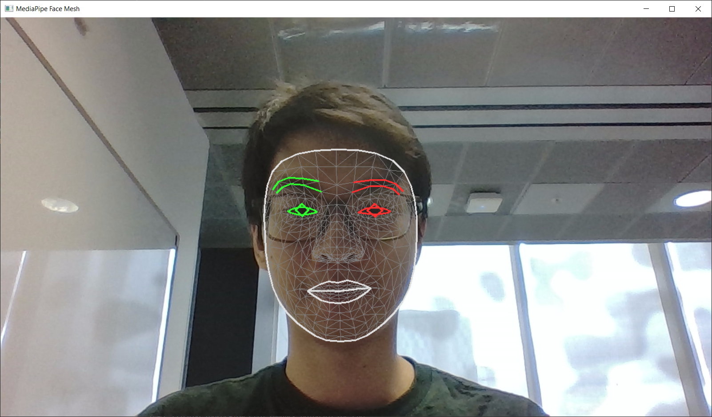
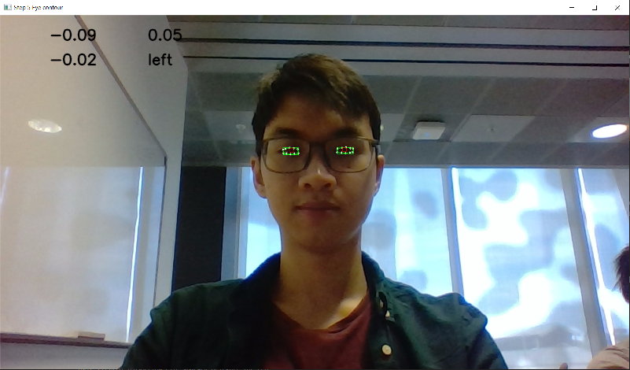
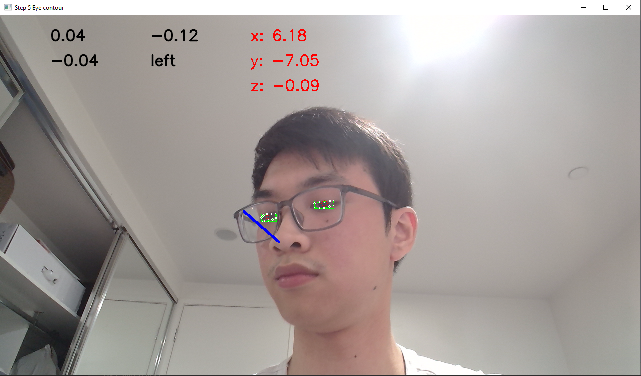

# Gazetracking - Onboarding

## Table of content

- [Overview](#overview)
- [Steps](#steps)
  - [Step 1: Install Conda](#step-1-install-conda)
  - [Step 2: Install dependencies](#step-2-install-dependencies)
  - [Step 3: Activate conda env and test run](#step-3-activate-conda-env-and-test-run)
  - [Step 4: Mediapipe library](#step-4-mediapipe-library)
  - [Step 5: Locate the eye and iris](#step-5-locate-the-eye-and-iris)
  - [Step 6: Get iris to box ratio for direction](#step-6-get-iris-to-box-ratio-for-direction)
  - [Step 7: Head rotation](#step-7-head-rotation)

## Overview

Onboarding documents, programs, tutorials and stuff for Gaze Baes new friends!

## Steps

### Step 1: Install Conda

You can either use `Anaconda`, which come with lots of packages for data science, or `Miniconda`, a lightweight version which only consist of necessary stuff. Personally, I recommended `Miniconda`.

- <https://www.anaconda.com/download>

- <https://docs.conda.io/projects/miniconda/en/latest/miniconda-install.html>

Then you just install it, following the instructions show. Remember to add conda to system PATH so you can you them in command line.

Use `conda list` in VScode terminal to see if it works.

In addition, it's recommended that you install Python extension to make thing easier. You can search for it on Market tab on VsCode, look for the one from Microsoft with the most download.

### Step 2: Install dependencies

Remember to clone this directory, and move the current directory to it.

There should be an environment.yml file already created for you in this repo, run `conda env create -f environment.yml` at root folder.

To update the env, use `conda env update --file environment.yml --prune`.

If you want to change the environment name, change the `name` attribute (1st line) in `environment.yml`.

### Step 3: Activate conda env and test run

In VsCode terminal, run `conda env list` to show the list of conda environment you have. It should show the \* at the top, base environment.

Then run `conda activate BCI-Gazetrack` (or different name if you changed it). Run `conda env list` again to confirm, the \* should be at the same line as BCI-Gazetrack.

Open the `step3.py` file to see if there are warnings about "cv2 can't resolve". You can open VsCode Command Pallete (Ctrl + Shift + P on Windows),then type and choose **Python: Select Interpreter**, then choose BCI-Gazetrack one.

Run `python step3.py`. If your computer has a camera connected (hopefully), it will show you _a breathtaking sight_!

**Press Q in openCV window to exit**. You can read a bit in the code to understand the minimal code to get OpenCV running.

### Step 4: Mediapipe library

[MediaPipe](https://github.com/google/mediapipe) is an open-source framework from Google for building pipelines to perform computer vision inference over arbitrary sensory data such as video or audio.

We will use this library to map the facial landmarks of our face, therefore get the location of important features such as the eyes and irises.

Run `python step4.py`, and it should also open your camera with extra stuff draw on your face. We mostly only care about the FACEMESH_TESSELATION (which is the web-like, grey thin lines draw on your face).

Each or the vertices for this mesh called a landmark and has an id, which you can reference with `facemesh_landmark_ref` in `\res` folder. Zoom in real close and you will see the number.

### Step 5: Locate the eye and iris

Next, we will see how to locate (and draw) the eyes and irises section on your face.

Run `python step5.py`. You should get something like this (with Daqlan as cameo):

### Step 6: Get iris to box ratio for direction

By calculate the iris's x position compared to the eye bounding box, we can calculate whether the user is looking left, center or right (which should give direction ration from -1 to 1)

In the output video, the 2 top number are gaze direction ratio for left and right eye. The bottom number is just the average, and the text show whenever you are looking left and right.

### Step 7: Head rotation

Added `get_head_rotation()`

Josh wrote this code so I have no idea what it does, but it calculate your head rotation / face direction angle so we can better estimate eye gaze direction

